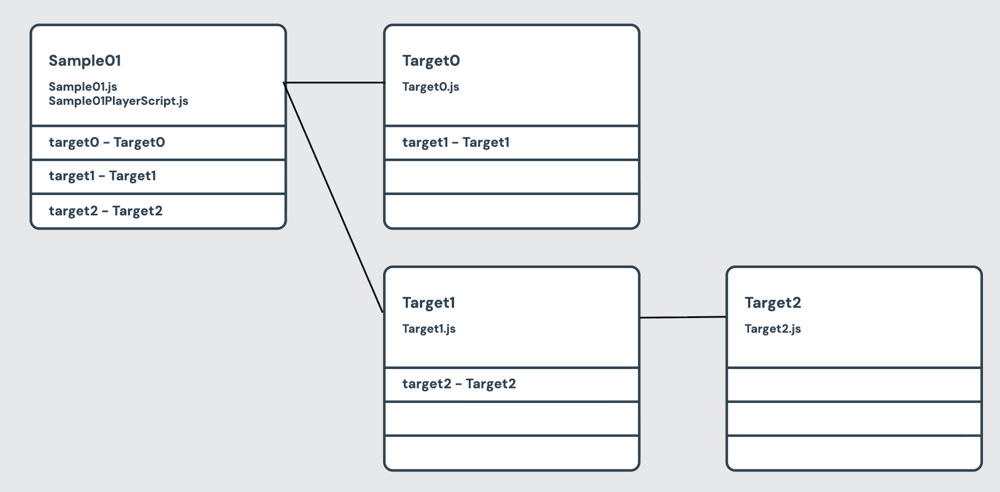

# WorldItemReferenceListTracer
WorldItemReferenceList に登録されているオブジェクトの関係が確認できるウインドウを表示する Unity Editor Script

## コンポーネント や Creator Kit Script
[World Item Reference List コンポーネント](https://docs.cluster.mu/creatorkit/item-components/world-item-reference-list/)

[$.worldItemReference](https://docs.cluster.mu/script/interfaces/ClusterScript.html#worldItemReference)

## 内容
1. ScriptItem コンポーネント を持つGameObjectを探す
2. ScriptItem コンポーネント に記載されている script ファイルを開いて `$.worldItemReference`, `_.worldItemReference` を参照している箇所を探す
3. 参照している箇所の WorldItemReferenceList コンポーネント が持っているリスト内のオブジェクトを探索する
4. 繋がりや階層わかるようなウインドウを表示する
    - GameObject オブジェクト名
    - ScriptItem コンポーネントに設定されている scriptファイル名
    - Scriptのどこで `$.worldItemReference`, `_.worldItemReference` が参照されているか
    - WorldItemReferenceList が持っているリスト内のオブジェクト名

### UIイメージ

## 参考
[CCKProcessTracer](https://github.com/ClusterVR/CCKProcessTracer)
